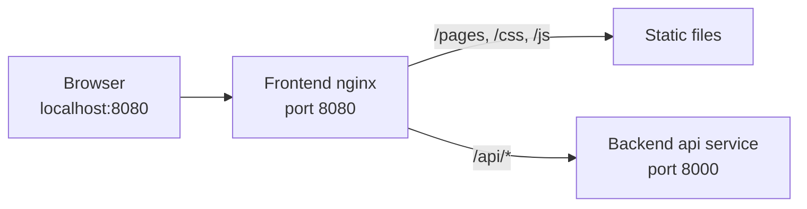

# nginx and browser security headers

**In short:** nginx is the one address the browser uses. It serves the frontend files,
passes `/api` requests to the backend, and attaches the browser security headers required
by the application.

## Request flow

The backend Compose project creates the `workforce-ops` network. The frontend Compose
project joins that existing network, where Docker DNS resolves the backend service name
`api`. Because `proxy_pass` has no replacement path, `/api/health` arrives at FastAPI as
`/api/health`.

The important files are:

- `Dockerfile`: copies only the static application and nginx configuration, then runs
  nginx as its built-in non-root user.
- `nginx/nginx.conf`: serves static files, defines the proxy, and adds headers.
- `docker-compose.yml`: publishes nginx on `127.0.0.1:8080` and joins the shared network.
- `tests/integration/`: starts an isolated API stand-in and checks the complete browser
  path without depending on a checkout of the backend repository.

## Content Security Policy

The policy contains no `unsafe-inline`, so scripts and styles must remain in their own
files. Each directive has one job:

| Directive | Meaning |
|---|---|
| `default-src 'self'` | Use this origin when a resource type has no more specific rule. |
| `script-src 'self'` | Run JavaScript files from this origin; do not run inline scripts. |
| `style-src 'self'` | Load stylesheets from this origin; do not apply inline styles. |
| `connect-src 'self'` | Let `fetch` call the same-origin `/api` routes. |
| `img-src 'self'` | Load images only from this origin. |
| `font-src 'self'` | Load fonts only from this origin. |
| `object-src 'none'` | Do not embed plugin content. |
| `base-uri 'none'` | Do not let a page change how relative URLs are interpreted. |
| `frame-ancestors 'none'` | Do not allow another page to frame the application. |
| `form-action 'self'` | Submit forms only to this origin. |

## Other response headers

- `X-Content-Type-Options: nosniff` makes browsers honor the declared content type.
- `Referrer-Policy: strict-origin-when-cross-origin` keeps full paths out of requests to
  another origin while retaining useful same-origin navigation information.
- `Permissions-Policy` disables camera, location, and microphone access because the
  application does not use them.
- `Strict-Transport-Security` is intentionally absent from local HTTP responses because
  browsers ignore it there. The nginx configuration emits a one-year policy with
  `includeSubDomains` when its connection scheme is HTTPS. If production terminates TLS
  before nginx instead, that HTTPS component must add the same header.

## Localhost session-cookie compatibility

The Playwright smoke test sends a `Secure; HttpOnly; SameSite=Strict; Path=/` cookie with
the `__Host-` prefix over `http://localhost`, then confirms that the browser stored it.
It runs with Chromium, Firefox, and WebKit, which represent the engines used by Chrome
and Edge, Firefox, and Safari respectively. Chromium and Firefox accept the cookie and
report `SameSite=Strict`. Playwright WebKit differs by host platform: its Windows build
accepts the cookie but reports `SameSite=None`, while its Linux build rejects the cookie.
The smoke test asserts both observed outcomes so CI records a behavioral change on either
platform without treating their known difference as an nginx failure.

This is an engine-level Phase 1 result, not a claim that every branded browser version
has been manually tested. Before Phase 2 finalizes sessions, confirm the same behavior
in current desktop Chrome, Edge, Firefox, and Safari on their supported operating
systems. Safari on macOS is especially important because Playwright WebKit is not the
branded Safari browser and its Windows and Linux builds already behave differently.
